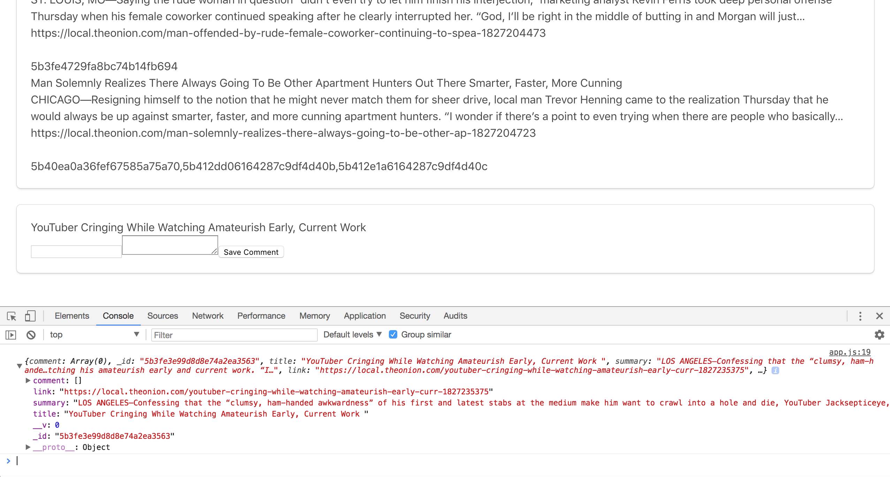

# basic-web-scraper

This shows the main page of the app after the articles have been scraped via the scrape route.

Clicking on an article headline shows the JSON data in console. Here you can see the Title, Summary, and Link for each article from The Onion.

If you scroll to the bottom after clicking on an article you will find the comment box.

After adding the comment it gets logged with the article in the database and shows up in console as part of its JSON object.

Using the comment's id, the comment can be deleted from the database. This is confirmed here in Terminal.

This is the JSON showing the comment has been deleted.
